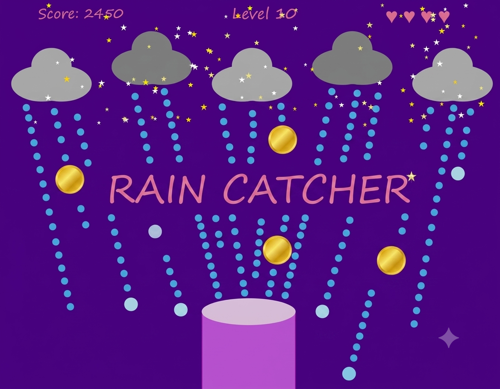

# Rain Catcher
 

## 🌧️ Rain Catcher
On a calm night beneath a sky filled with twinkling stars, enchanted clouds drift across the horizon, releasing magical droplets from above.
You are the Rain Keeper, entrusted with collecting these precious drops before they disappear into the darkness below.
Armed with only your bucket and quick reflexes, you must catch as many drops as possible while the storm grows stronger.
As the night progresses:
•	The rain falls faster.
•	More drops appear.
•	The challenge becomes increasingly difficult.
Among the ordinary raindrops are rare Golden Drops infused with powerful magic.
Catching one rewards you with a huge score bonus, making them especially valuable.
But be careful!!
Every two drops that slip past your bucket cost a life. Once all your lives are gone, your journey as the Rain Keeper comes to an end.

## 🎮 How to Play
### 🕹️ Controls
- ⬅️ Left Arrow Key — Move the bucket left  
- ➡️ Right Arrow Key — Move the bucket right  

### 🧮 Scoring
- 💧 Regular Drop = 50 points  
- 🏆 Golden Drop = 200 points  

### ❤️ Lives
- Start with 5 lives ❤️❤️❤️❤️❤️  
- Every 2 missed drops costs 1 life  
- Lose all hearts and the game is over ☠️  

### 📈 Levels
As your score increases:
- Rain falls faster  
- More drops appear  
- The game becomes progressively harder  

### 🎯 Objective
Catch as many drops as possible, collect valuable Golden Drops, survive the growing storm, and achieve the highest score you can.

> “Beneath the stars, every drop counts.” ✨🌧️

## 🛠️ Built With
•	Python
•	Stanford Code in Place Graphics Library (graphics.Canvas)

## ℹ️ Note
This project was developed as part of Stanford's Code in Place program and uses the Code in Place graphics library (graphics.Canvas). The game runs in the Code in Place environment and may require the course graphics package to run outside that environment.
